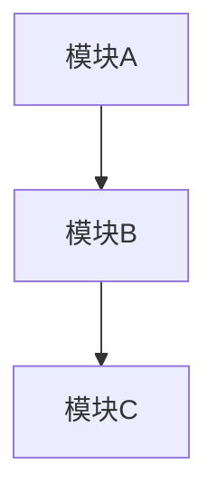
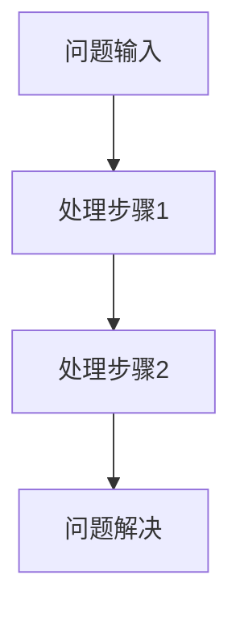

# Tech Design Doc Skill

用于技术方案和架构设计的完整工作流程，包括技术调研、项目分析、方案设计和文档生成。

## 触发条件

当用户请求以下任务时使用此 skill：
- 技术方案设计
- 架构设计文档
- 技术调研报告
- 设计文档编写
- 方案对比分析

## 工作流程概述

```
┌─────────────────────────────────────────────────────────────────────┐
│                      Tech Design Doc 工作流程                        │
├─────────────────────────────────────────────────────────────────────┤
│                                                                     │
│  阶段1: 技术调研 (Research Phase)                                    │
│  ├── 创建调研目录: tmp/{project-name}/                               │
│  ├── 网络搜索: 业界/学术界方案 (≥15篇文章)                             │
│  ├── 内容收集: 下载/存储调研资料                                       │
│  └── 方案对比: 分析各方案优缺点                                        │
│                                                                     │
│  阶段2: 项目分析 (Project Analysis Phase)                            │
│  ├── 代码分析: 现有实现逻辑                                           │
│  ├── 模块识别: 可复用的模块                                           │
│  └── 分析报告: 存储到调研目录                                          │
│                                                                     │
│  阶段3: 设计思路 (Design Thinking Phase)                             │
│  ├── 综合分析: 外部调研 + 内部实现                                     │
│  └── 设计思路: 写入调研目录                                           │
│                                                                     │
│  阶段4: 文档生成 (Document Generation Phase)                         │
│  ├── 文档结构: 参考 doc/design/*.md 模板                              │
│  ├── 方案调研: 突出调研内容和结论                                      │
│  ├── 问题重点: 突出重要问题和解决思路                                   │
│  └── 输出位置: doc/design/{document-name}.md                         │
│                                                                     │
│  阶段5: 格式转换 (Optional)                                          │
│  └── DOCX 转换: 使用 markdown-docx 工具                               │
│                                                                     │
└─────────────────────────────────────────────────────────────────────┘
```

---

## 阶段1: 技术调研 (Research Phase)

### 1.1 创建调研目录

```bash
# 在 tmp 目录下创建项目调研目录
mkdir -p tmp/{project-name}/research
mkdir -p tmp/{project-name}/analysis
mkdir -p tmp/{project-name}/design
```

### 1.2 网络调研要求

**调研数量**: 不少于 15 篇文章/资料

**调研来源**:
- 技术博客 (Medium, Dev.to, 掘金, 知乎等)
- 官方文档
- GitHub 项目 README
- 学术论文 (arXiv, IEEE, ACM)
- 技术会议演讲 (InfoQ, QCon, GopherCon)
- 云厂商最佳实践 (AWS, GCP, Azure, 阿里云)

**调研内容记录模板**:

```markdown
# 调研资料汇总

## 资料列表

### 1. {资料标题}
- **来源**: {URL}
- **类型**: 博客/论文/官方文档/开源项目
- **核心观点**:
  - 观点1
  - 观点2
- **技术方案**:
  - 方案描述
- **优点**:
  - 优点1
- **缺点**:
  - 缺点1
- **适用场景**:
  - 场景描述

### 2. {资料标题}
...
```

### 1.3 方案对比分析

在调研目录下创建 `comparison.md`：

```markdown
# 技术方案对比分析

## 方案概览

| 方案 | 核心思路 | 复杂度 | 性能 | 可维护性 | 成熟度 | 参考来源 |
|------|----------|--------|------|----------|--------|----------|
| 方案A | ... | 高/中/低 | 高/中/低 | 高/中/低 | 成熟/新兴 | [[1]](#ref-1) [[2]](#ref-2) |
| 方案B | ... | ... | ... | ... | ... | [[3]](#ref-3) [[4]](#ref-4) |

## 详细对比

### 方案A: {方案名称} [[1]](#ref-1) [[2]](#ref-2)

**核心思路**:
{描述}

**优点**:
1. 优点1
2. 优点2

**缺点**:
1. 缺点1
2. 缺点2

**适用场景**:
- 场景1
- 场景2

**业界案例**:
- 公司A: 使用场景
- 公司B: 使用场景

### 方案B: {方案名称} [[3]](#ref-3) [[4]](#ref-4)
...

## 推荐结论

**推荐方案**: 方案X

**推荐理由**:
1. 理由1
2. 理由2

**风险点**:
1. 风险1 - 缓解措施
2. 风险2 - 缓解措施
```

---

## 阶段2: 项目分析 (Project Analysis Phase)

### 2.1 代码分析

分析当前项目中的相关实现：

```markdown
# 项目现有实现分析

## 相关模块

### 模块1: {模块名称}
- **位置**: {文件路径}
- **功能**: {功能描述}
- **核心接口**:
  ```go
  type IXxxService interface {
      Method1(ctx context.Context) error
      Method2(ctx context.Context, param *Param) (*Result, error)
  }
  ```
- **可复用性**: 高/中/低
- **复用方式**: {描述如何复用}

### 模块2: {模块名称}
...

## 依赖关系



## 可复用组件清单

| 组件 | 位置 | 功能 | 复用方式 |
|------|------|------|----------|
| 组件1 | path/to/file.go | 功能描述 | 直接调用/封装/改造 |
| 组件2 | ... | ... | ... |

## 需要新建的组件

| 组件 | 功能 | 依赖 | 优先级 |
|------|------|------|--------|
| 新组件1 | 功能描述 | 依赖列表 | P0/P1/P2 |
```

### 2.2 分析结果存储

将分析结果保存到: `tmp/{project-name}/analysis/project_analysis.md`

---

## 阶段3: 设计思路 (Design Thinking Phase)

### 3.1 综合分析

结合外部调研和内部分析，形成设计思路：

```markdown
# 设计思路

## 背景与目标

### 业务背景
{描述业务背景}

### 技术目标
1. 目标1
2. 目标2

## 设计原则

1. **原则1**: 描述
2. **原则2**: 描述

## 核心设计决策

### 决策1: {决策标题}

**问题**: {描述问题}

**可选方案**:
| 方案 | 描述 | 优点 | 缺点 |
|------|------|------|------|
| A | ... | ... | ... |
| B | ... | ... | ... |

**选择**: 方案X

**理由**:
1. 理由1
2. 理由2

### 决策2: {决策标题}
...

## 技术选型

| 技术领域 | 选型 | 理由 |
|----------|------|------|
| 存储 | MySQL/Redis/... | 理由 |
| 消息队列 | Kafka/... | 理由 |
| ... | ... | ... |

## 风险评估

| 风险 | 影响 | 概率 | 缓解措施 |
|------|------|------|----------|
| 风险1 | 高/中/低 | 高/中/低 | 措施描述 |
```

### 3.2 设计思路存储

将设计思路保存到: `tmp/{project-name}/design/design_thinking.md`

---

## 阶段4: 文档生成 (Document Generation Phase)

### 4.1 文档结构模板

参考 `doc/design/` 下的现有文档结构，生成的设计文档应包含以下章节：

```markdown
# {功能名称}架构文档

## 目录

- [项目标识](#项目标识)
- [1. 方案调研](#1-方案调研)              ← 【重要】调研先行，为设计提供依据
  - [1.1 业界方案调研](#11-业界方案调研)
  - [1.2 方案对比分析](#12-方案对比分析)
  - [1.3 调研结论](#13-调研结论)
- [2. 关键问题与解决方案](#2-关键问题与解决方案)  ← 【重要】问题驱动设计
  - [2.1 问题1: {问题描述}](#21-问题1)
  - [2.2 问题2: {问题描述}](#22-问题2)
- [3. 概要设计](#3-概要设计)              ← 基于调研结论和问题解决方案
  - [3.1 架构层级图](#31-架构层级图)
  - [3.2 层级说明](#32-层级说明)
  - [3.3 核心数据流](#33-核心数据流)
  - [3.4 核心能力矩阵](#34-核心能力矩阵)
- [4. 功能概述](#4-功能概述)
  - [4.1 功能目标](#41-功能目标)
  - [4.2 核心能力](#42-核心能力)
  - [4.3 依赖组件](#43-依赖组件)
  - [4.4 项目结构](#44-项目结构)
- [5. 系统架构图](#5-系统架构图)
  - [5.1 C4 Context 层级图](#51-c4-context-层级图)
  - [5.2 C4 Container 层级图](#52-c4-container-层级图)
  - [5.3 C4 Component 层级图](#53-c4-component-层级图)
  - [5.4 服务数据流图](#54-服务数据流图)
- [6. 数据模型](#6-数据模型)
- [7. API 定义](#7-api-定义)
- [8. 安全设计](#8-安全设计)
- [术语表](#术语表)
- [附录](#附录)
  - [附录 A: 完整时序图](#附录-a-完整时序图)
  - [附录 B: 参考文献](#附录-b-参考文献)

---

## 项目标识

| 字段 | 值 |
|------|-----|
| **项目名称** | {Project Name} |
| **分支名称** | feature/{branch-name} |
| **仓库地址** | git.garena.com/shopee/... |
| **联系人** | {Team Name} |
| **文档日期** | {YYYY-MM-DD} |
| **版本** | 1.0.0 |
| **状态** | 设计阶段 |

---

## 1. 方案调研 【重点章节 - 调研先行】

> 在进行概要设计之前，必须充分了解业界最佳实践和各方案的优劣。

### 1.1 业界方案调研

本节总结了对 {技术领域} 的业界调研结果，共收集分析了 {N} 篇技术资料。

#### 1.1.1 主流技术方案

| 方案类型 | 代表实现 | 核心思路 | 典型应用 |
|----------|----------|----------|----------|
| 方案A | 实现1, 实现2 | 思路描述 | 公司X, 公司Y |
| 方案B | 实现3 | 思路描述 | 公司Z |

#### 1.1.2 方案详情

**方案A: {方案名称}**

{详细描述方案A的核心思路、实现方式、适用场景}

**方案B: {方案名称}**

{详细描述方案B的核心思路、实现方式、适用场景}

### 1.2 方案对比分析

| 维度 | 方案A | 方案B | 方案C |
|------|-------|-------|-------|
| 复杂度 | ⭐⭐⭐ | ⭐⭐ | ⭐ |
| 性能 | ⭐⭐ | ⭐⭐⭐ | ⭐⭐ |
| 可维护性 | ⭐⭐⭐ | ⭐⭐ | ⭐⭐⭐ |
| 扩展性 | ⭐⭐ | ⭐⭐⭐ | ⭐⭐ |
| 社区支持 | ⭐⭐⭐ | ⭐⭐ | ⭐ |

### 1.3 调研结论

**选定方案**: {方案名称}

**选择理由**:
1. 理由1
2. 理由2
3. 理由3

**需要注意的风险**:
1. 风险1 及缓解措施
2. 风险2 及缓解措施

---

## 2. 关键问题与解决方案 【重点章节 - 问题驱动设计】

> 这些问题来源于调研分析和业务需求，是架构设计的核心驱动因素。

### 2.1 问题1: {问题描述}

**问题背景**:
{描述问题产生的背景和原因}

**问题影响**:
{描述如果不解决会带来什么影响}

**解决思路**:
{详细描述解决方案}



**实现要点**:
1. 要点1
2. 要点2

### 2.2 问题2: {问题描述}
...

---

## 3. 概要设计

> 基于方案调研结论和关键问题的解决思路，本节给出系统的概要设计。

(架构层级图、层级说明、核心数据流、核心能力矩阵...)
```

### 4.2 文档输出位置

所有设计文档必须输出到: `doc/design/{document-name}.md`

### 4.3 Mermaid 图表规范

使用 Mermaid 绘制架构图，支持的图表类型：
- `flowchart TB/LR`: 流程图
- `sequenceDiagram`: 时序图
- `block-beta`: 分层架构图
- `erDiagram`: ER 图

---

## 阶段5: DOCX 转换 (Optional)

当用户要求生成 DOCX 文档时，使用 markdown-docx 工具转换。

### 5.1 工具位置

```
.claude/skills/tech-design-doc/scripts/markdown-docx/
```

### 5.2 使用方法

```bash
# 进入工具目录
cd .claude/skills/tech-design-doc/scripts/markdown-docx

# 安装依赖 (首次使用)
./setup.sh
# 或
poetry install

# 单文件转换
poetry run md2docx --single ../../doc/design/{file}.md output/{file}.docx

# 批量转换 (将 doc/design 下所有 md 转换)
poetry run md2docx -i ../../../../doc/design -o output

# 使用不同主题
poetry run md2docx --theme forest -i ../../../../doc/design -o output
```

### 5.3 可用主题

| 主题 | 描述 |
|------|------|
| default | 默认主题 |
| dark | 深色主题 |
| forest | 森林绿主题 |
| ocean | 海洋蓝主题 |
| elegant | 优雅主题 |

---

## 完整工作流程示例

### 示例: 设计一个 "消息队列消费服务"

```
用户: 帮我设计一个 Kafka 消费服务的技术方案

Claude 执行:

1. 【创建调研目录】
   mkdir -p tmp/kafka-consumer/research
   mkdir -p tmp/kafka-consumer/analysis
   mkdir -p tmp/kafka-consumer/design

2. 【技术调研】
   - 搜索 "Kafka consumer best practices"
   - 搜索 "Kafka consumer group rebalance"
   - 搜索 "Kafka exactly once semantics"
   ... (收集 15+ 篇文章)

   输出: tmp/kafka-consumer/research/research_summary.md
   输出: tmp/kafka-consumer/research/comparison.md

3. 【项目分析】
   - 分析项目中现有的 Kafka 消费实现
   - 识别可复用的组件

   输出: tmp/kafka-consumer/analysis/project_analysis.md

4. 【设计思路】
   - 综合外部调研和内部分析
   - 形成设计决策

   输出: tmp/kafka-consumer/design/design_thinking.md

5. 【生成设计文档】
   - 按照模板结构生成完整文档
   - 突出方案调研内容
   - 突出关键问题和解决方案

   输出: doc/design/KAFKA-CONSUMER.md

6. 【可选: DOCX 转换】
   cd .claude/skills/tech-design-doc/scripts/markdown-docx
   poetry run md2docx --single ../../../../doc/design/KAFKA-CONSUMER.md output/KAFKA-CONSUMER.docx
```

---

## 注意事项

1. **调研深度**: 确保调研不少于 15 篇文章，覆盖多个来源
2. **方案对比**: 必须提供至少 2-3 个可选方案的对比分析
3. **问题导向**: 设计文档要突出关键问题和解决思路
4. **图表规范**: 使用 Mermaid 绘制架构图，确保清晰易懂
5. **代码示例**: 关键实现需要提供伪代码或核心代码片段
6. **引用来源**: 在附录中列出所有调研资料来源
7. **引用标记**: 方案概览和对比中必须使用 `[[n]](#ref-n)` 格式标记每个方案的参考来源，确保可追溯性

## 相关资源

- 设计文档模板: `doc/design/*.md`
- DOCX 转换工具: `.claude/skills/tech-design-doc/scripts/markdown-docx/`
- C4 模型参考: https://c4model.com/
- Mermaid 语法: https://mermaid.js.org/
