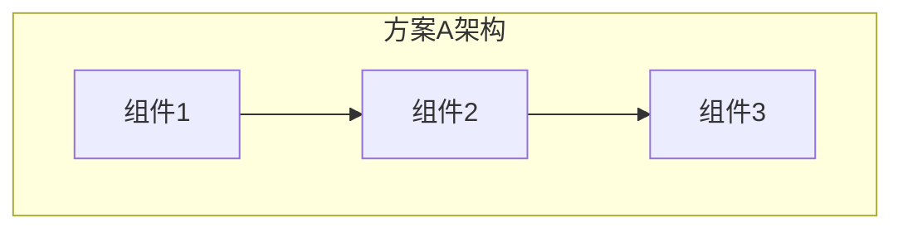

# 技术方案对比分析

> 项目: {PROJECT_NAME}
> 日期: {DATE}
> 分析人: {AUTHOR}

## 方案概览

本节对调研收集的技术方案进行系统性对比分析，帮助做出最优技术选型决策。

### 候选方案列表

| 序号 | 方案名称 | 核心思路 | 代表实现 | 参考来源 |
|------|----------|----------|----------|----------|
| 1 | 方案A | 思路概述 | 实现1, 实现2 | [[1]](#ref-1) [[2]](#ref-2) |
| 2 | 方案B | 思路概述 | 实现3 | [[3]](#ref-3) [[4]](#ref-4) |
| 3 | 方案C | 思路概述 | 实现4 | [[5]](#ref-5) [[6]](#ref-6) |

---

## 多维度对比矩阵

### 技术维度对比

| 维度 | 方案A | 方案B | 方案C | 权重 |
|------|-------|-------|-------|------|
| **实现复杂度** | ⭐⭐⭐ (高) | ⭐⭐ (中) | ⭐ (低) | 20% |
| **性能表现** | ⭐⭐ (中) | ⭐⭐⭐ (高) | ⭐⭐ (中) | 25% |
| **可维护性** | ⭐⭐⭐ (高) | ⭐⭐ (中) | ⭐⭐⭐ (高) | 20% |
| **扩展性** | ⭐⭐ (中) | ⭐⭐⭐ (高) | ⭐⭐ (中) | 15% |
| **学习曲线** | ⭐ (陡峭) | ⭐⭐ (中等) | ⭐⭐⭐ (平缓) | 10% |
| **社区生态** | ⭐⭐⭐ (成熟) | ⭐⭐ (发展中) | ⭐ (较弱) | 10% |
| **综合评分** | **X.X** | **X.X** | **X.X** | 100% |

### 业务适配度对比

| 业务需求 | 方案A | 方案B | 方案C |
|----------|-------|-------|-------|
| 需求1: {描述} | ✅ 支持 | ⚠️ 部分支持 | ❌ 不支持 |
| 需求2: {描述} | ✅ 支持 | ✅ 支持 | ✅ 支持 |
| 需求3: {描述} | ⚠️ 需改造 | ✅ 支持 | ✅ 支持 |

### 成本对比

| 成本类型 | 方案A | 方案B | 方案C |
|----------|-------|-------|-------|
| 开发人力 | X 人天 | X 人天 | X 人天 |
| 基础设施 | 高/中/低 | 高/中/低 | 高/中/低 |
| 运维成本 | 高/中/低 | 高/中/低 | 高/中/低 |
| 迁移成本 | 高/中/低 | 高/中/低 | 高/中/低 |

---

## 详细方案分析

### 方案A: {方案名称} [[1]](#ref-1) [[2]](#ref-2)

#### 核心思路

{详细描述方案A的核心设计思路}

#### 架构图



#### 优点

1. **优点1**: 详细描述
2. **优点2**: 详细描述
3. **优点3**: 详细描述

#### 缺点

1. **缺点1**: 详细描述
   - 影响: 影响描述
   - 缓解: 缓解措施
2. **缺点2**: 详细描述
   - 影响: 影响描述
   - 缓解: 缓解措施

#### 适用场景

- 场景1: 描述
- 场景2: 描述

#### 业界案例

| 公司/项目 | 使用场景 | 规模 | 效果 |
|-----------|----------|------|------|
| 公司A | 场景描述 | 规模描述 | 效果描述 |
| 公司B | 场景描述 | 规模描述 | 效果描述 |

---

### 方案B: {方案名称} [[3]](#ref-3) [[4]](#ref-4)

#### 核心思路

{详细描述方案B的核心设计思路}

#### 架构图


#### 优点

1. **优点1**: 详细描述
2. **优点2**: 详细描述

#### 缺点

1. **缺点1**: 详细描述
2. **缺点2**: 详细描述

#### 适用场景

- 场景1: 描述
- 场景2: 描述

---

### 方案C: {方案名称} [[5]](#ref-5) [[6]](#ref-6)

(按相同结构填写)

---

## 风险分析

### 各方案风险对比

| 风险类型 | 方案A | 方案B | 方案C |
|----------|-------|-------|-------|
| 技术风险 | 高/中/低 | 高/中/低 | 高/中/低 |
| 进度风险 | 高/中/低 | 高/中/低 | 高/中/低 |
| 运维风险 | 高/中/低 | 高/中/低 | 高/中/低 |
| 人员风险 | 高/中/低 | 高/中/低 | 高/中/低 |

### 关键风险及缓解措施

| 风险 | 影响 | 概率 | 缓解措施 |
|------|------|------|----------|
| 风险1 | 高/中/低 | 高/中/低 | 措施描述 |
| 风险2 | 高/中/低 | 高/中/低 | 措施描述 |

---

## 推荐结论

### 推荐方案

**推荐采用: 方案{X}**

### 推荐理由

1. **理由1**: 详细说明
2. **理由2**: 详细说明
3. **理由3**: 详细说明

### 实施建议

1. **阶段1**: 描述
2. **阶段2**: 描述
3. **阶段3**: 描述

### 需要注意的事项

1. 注意事项1
2. 注意事项2
3. 注意事项3

---

## 附录: 方案评分计算

### 评分标准

| 星级 | 分数 | 含义 |
|------|------|------|
| ⭐⭐⭐ | 3分 | 优秀 |
| ⭐⭐ | 2分 | 良好 |
| ⭐ | 1分 | 一般 |

### 加权评分计算

```
综合评分 = Σ(维度分数 × 权重)

方案A = X×20% + X×25% + X×20% + X×15% + X×10% + X×10% = X.X
方案B = X×20% + X×25% + X×20% + X×15% + X×10% + X×10% = X.X
方案C = X×20% + X×25% + X×20% + X×15% + X×10% + X×10% = X.X
```

---

## 附录: 参考文献

> 以下是本对比分析引用的调研资料，编号与正文中的引用标记对应。

<a id="ref-1"></a>
**[1]** {作者}. "{文章标题}". {平台/网站名称}, {发布日期}. [在线] 可访问: {URL}

<a id="ref-2"></a>
**[2]** {作者}. "{文章标题}". {平台/网站名称}, {发布日期}. [在线] 可访问: {URL}

<a id="ref-3"></a>
**[3]** {作者}. "{文章标题}". {平台/网站名称}, {发布日期}. [在线] 可访问: {URL}

<a id="ref-4"></a>
**[4]** {组织/公司}. "{文档标题}". {文档版本}, {发布日期}. [在线] 可访问: {URL}

<a id="ref-5"></a>
**[5]** {作者/组织}. "{项目名称}". GitHub, {最后更新日期}. [在线] 可访问: {URL}

<a id="ref-6"></a>
**[6]** {作者/组织}. "{项目名称}". GitHub, {最后更新日期}. [在线] 可访问: {URL}

### 参考文献汇总表

| 编号 | 类型 | 标题 | 来源 | 链接 |
|------|------|------|------|------|
| [1] | 博客 | {文章标题} | {作者/平台} | [链接]({URL}) |
| [2] | 博客 | {文章标题} | {作者/平台} | [链接]({URL}) |
| [3] | 博客 | {文章标题} | {作者/平台} | [链接]({URL}) |
| [4] | 官方文档 | {文档标题} | {组织} | [链接]({URL}) |
| [5] | 开源项目 | {项目名称} | GitHub | [链接]({URL}) |
| [6] | 开源项目 | {项目名称} | GitHub | [链接]({URL}) |
