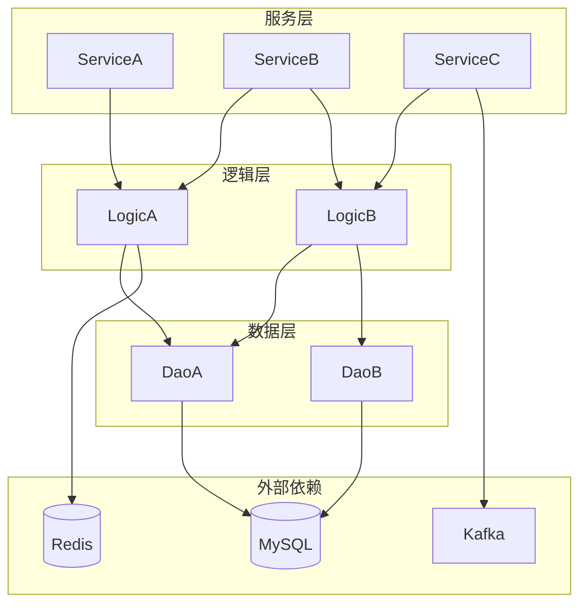
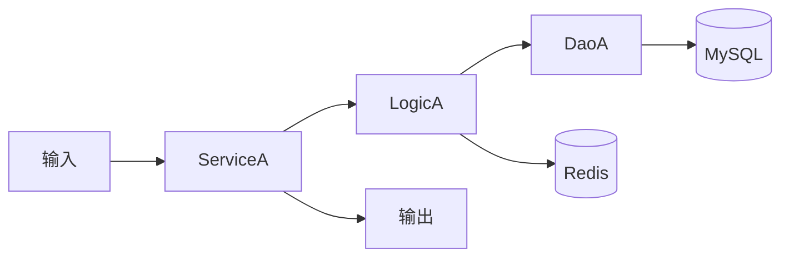

# 项目现有实现分析

> 项目: {PROJECT_NAME}
> 日期: {DATE}
> 分析人: {AUTHOR}

## 分析目标

{描述本次分析的目标，例如：分析项目中与 XXX 功能相关的现有实现，识别可复用组件}

---

## 相关模块清单

### 模块1: {模块名称}

**基本信息**:
| 属性 | 值 |
|------|-----|
| 位置 | `path/to/module/` |
| 功能 | {功能描述} |
| 负责人 | {负责人} |
| 状态 | 活跃 / 维护中 / 废弃 |

**核心接口**:
```go
// IXxxService 接口定义
type IXxxService interface {
    // Method1 方法1描述
    Method1(ctx context.Context, param1 string) error

    // Method2 方法2描述
    Method2(ctx context.Context, req *Request) (*Response, error)
}
```

**核心实现**:
```go
// XxxService 实现
type XxxService struct {
    // 依赖注入
    db     *sql.DB
    cache  ICache
    config *Config
}

func (s *XxxService) Method1(ctx context.Context, param1 string) error {
    // 核心逻辑概述
}
```

**可复用性评估**:
| 维度 | 评分 | 说明 |
|------|------|------|
| 接口抽象 | ⭐⭐⭐ | 接口设计良好，易于扩展 |
| 代码质量 | ⭐⭐ | 有一些技术债务 |
| 测试覆盖 | ⭐⭐ | 覆盖率约 60% |
| 文档完整 | ⭐ | 文档较少 |
| **综合** | **⭐⭐** | 可复用，需少量改造 |

**复用方式**:
- [ ] 直接调用
- [x] 封装后使用
- [ ] 需要改造
- [ ] 不建议复用

---

### 模块2: {模块名称}

**基本信息**:
| 属性 | 值 |
|------|-----|
| 位置 | `path/to/module/` |
| 功能 | {功能描述} |
| 负责人 | {负责人} |
| 状态 | 活跃 / 维护中 / 废弃 |

**核心接口**:
```go
type IYyyService interface {
    // ...
}
```

**可复用性评估**:
| 维度 | 评分 | 说明 |
|------|------|------|
| 接口抽象 | ⭐⭐ | ... |
| 代码质量 | ⭐⭐⭐ | ... |
| 测试覆盖 | ⭐⭐ | ... |
| 文档完整 | ⭐⭐ | ... |
| **综合** | **⭐⭐** | ... |

---

## 依赖关系图

### 模块依赖关系



### 数据流向



---

## 可复用组件清单

### 直接可用组件

| 组件 | 位置 | 功能 | 复用方式 | 备注 |
|------|------|------|----------|------|
| ConnPool | `pkg/pool/conn_pool.go` | 连接池管理 | 直接调用 | 已稳定运行 |
| CryptoUtil | `pkg/util/crypto.go` | 加解密工具 | 直接调用 | 支持 AES/RSA |
| Logger | `pkg/log/logger.go` | 日志组件 | 直接调用 | 项目标准 |

### 需改造组件

| 组件 | 位置 | 当前功能 | 需要改造 | 改造工作量 |
|------|------|----------|----------|------------|
| Parser | `pkg/parser/` | 解析 A 格式 | 扩展支持 B 格式 | 2 人天 |
| Handler | `pkg/handler/` | 处理 X 类型 | 增加 Y 类型 | 1 人天 |

### 不可复用组件

| 组件 | 位置 | 不可复用原因 |
|------|------|--------------|
| OldService | `pkg/legacy/` | 架构不符合新设计 |
| DeprecatedUtil | `pkg/util/old.go` | 已标记废弃 |

---

## 需要新建的组件

| 组件 | 功能描述 | 依赖组件 | 优先级 | 预估工作量 |
|------|----------|----------|--------|------------|
| NewService | 新功能主服务 | ConnPool, Logger | P0 | 5 人天 |
| NewLogic | 核心业务逻辑 | Parser, CryptoUtil | P0 | 3 人天 |
| NewDao | 数据访问层 | - | P1 | 2 人天 |
| NewHandler | 请求处理器 | NewService | P1 | 2 人天 |

---

## 技术债务识别

### 现有技术债务

| 债务 | 位置 | 影响 | 优先级 | 建议处理 |
|------|------|------|--------|----------|
| 硬编码配置 | `config.go:45` | 环境切换困难 | P2 | 本次顺带修复 |
| 缺少错误处理 | `handler.go:120` | 可能 panic | P1 | 必须修复 |
| 代码重复 | `service_*.go` | 维护困难 | P3 | 后续重构 |

### 建议本次清理

- [ ] 清理债务1: {描述}
- [ ] 清理债务2: {描述}

---

## 风险评估

### 复用风险

| 风险 | 影响 | 概率 | 缓解措施 |
|------|------|------|----------|
| 接口不兼容 | 高 | 低 | 增加适配层 |
| 性能瓶颈 | 中 | 中 | 增加缓存 |
| 测试不足 | 中 | 高 | 补充测试用例 |

### 改造风险

| 风险 | 影响 | 概率 | 缓解措施 |
|------|------|------|----------|
| 影响现有功能 | 高 | 中 | 增加回归测试 |
| 改造范围蔓延 | 中 | 中 | 严格控制边界 |

---

## 分析结论

### 复用策略总结

1. **直接复用** (X 个组件):
   - 组件1, 组件2, 组件3

2. **改造后复用** (X 个组件):
   - 组件4: 改造点描述
   - 组件5: 改造点描述

3. **需新建** (X 个组件):
   - 新组件1: 功能描述
   - 新组件2: 功能描述

### 工作量预估

| 类型 | 数量 | 预估工作量 |
|------|------|------------|
| 直接复用 | X | 0 人天 |
| 改造复用 | X | X 人天 |
| 新建组件 | X | X 人天 |
| 测试补充 | - | X 人天 |
| **总计** | - | **X 人天** |

### 建议实施顺序

1. **阶段1**: 新建核心组件 (P0)
2. **阶段2**: 改造可复用组件
3. **阶段3**: 集成测试
4. **阶段4**: 清理技术债务 (可选)
