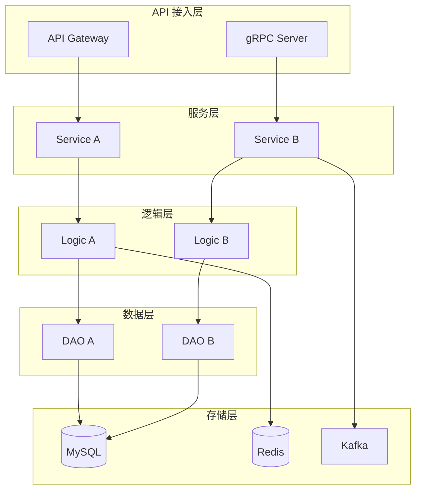
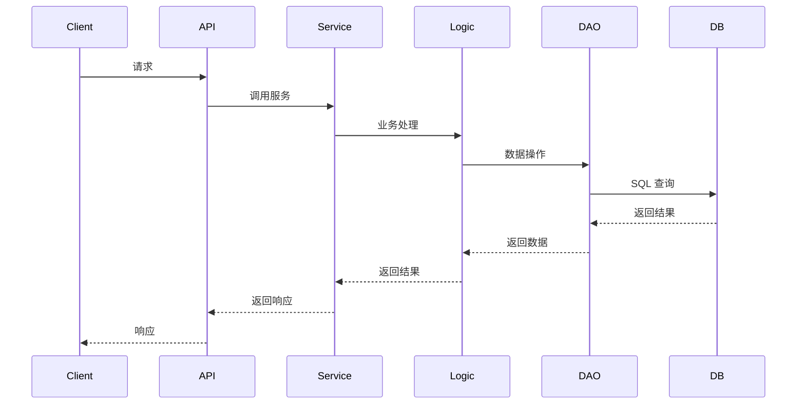

# 设计思路文档

> 项目: {PROJECT_NAME}
> 日期: {DATE}
> 设计人: {AUTHOR}

## 背景与目标

### 业务背景

{描述项目的业务背景，为什么要做这个功能}

- 背景1: 描述
- 背景2: 描述
- 背景3: 描述

### 技术目标

| 序号 | 目标 | 衡量标准 | 优先级 |
|------|------|----------|--------|
| 1 | 目标1描述 | 如何衡量是否达成 | P0 |
| 2 | 目标2描述 | 如何衡量是否达成 | P0 |
| 3 | 目标3描述 | 如何衡量是否达成 | P1 |

### 非目标 (Not Goals)

明确说明本次设计不包含的内容：

- 非目标1: 原因
- 非目标2: 原因

---

## 设计原则

### 核心原则

1. **原则1: {原则名称}**
   - 描述: {详细描述}
   - 示例: {如何应用}

2. **原则2: {原则名称}**
   - 描述: {详细描述}
   - 示例: {如何应用}

3. **原则3: {原则名称}**
   - 描述: {详细描述}
   - 示例: {如何应用}

### 架构约束

| 约束 | 原因 | 影响 |
|------|------|------|
| 必须使用现有的 XXX 组件 | 降低维护成本 | 设计需要适配现有接口 |
| 数据库选型限定为 MySQL | 运维统一管理 | 不能使用 NoSQL |
| 部署环境为 K8s | 公司标准 | 需要支持水平扩展 |

---

## 核心设计决策

### 决策1: {决策标题}

**问题描述**:
{描述需要做决策的问题}

**影响范围**:
- 影响1
- 影响2

**可选方案**:

| 方案 | 描述 | 优点 | 缺点 |
|------|------|------|------|
| A | 方案A描述 | 优点1, 优点2 | 缺点1, 缺点2 |
| B | 方案B描述 | 优点1, 优点2 | 缺点1, 缺点2 |
| C | 方案C描述 | 优点1, 优点2 | 缺点1, 缺点2 |

**决策结果**: 选择方案 {X}

**决策理由**:
1. 理由1: 详细说明
2. 理由2: 详细说明
3. 理由3: 详细说明

**后续影响**:
- 影响1: 描述
- 影响2: 描述

---

### 决策2: {决策标题}

**问题描述**:
{描述需要做决策的问题}

**可选方案**:

| 方案 | 描述 | 优点 | 缺点 |
|------|------|------|------|
| A | 方案A描述 | 优点1 | 缺点1 |
| B | 方案B描述 | 优点1 | 缺点1 |

**决策结果**: 选择方案 {X}

**决策理由**:
1. 理由1
2. 理由2

---

### 决策3: {决策标题}

(按相同格式继续)

---

## 技术选型

### 技术栈总览

| 技术领域 | 选型 | 版本 | 选择理由 |
|----------|------|------|----------|
| 编程语言 | Go | 1.21+ | 项目统一技术栈 |
| Web框架 | Gin | v1.9+ | 高性能，团队熟悉 |
| 数据库 | MySQL | 8.0+ | 运维统一管理 |
| 缓存 | Redis | 7.0+ | 高性能，支持多数据结构 |
| 消息队列 | Kafka | 3.x | 高吞吐，持久化 |
| RPC框架 | gRPC | v1.58+ | 高性能，强类型 |
| 日志 | Zap | v1.26+ | 高性能结构化日志 |

### 核心依赖库

| 库 | 用途 | 版本 | 备注 |
|-----|------|------|------|
| sqlx | 数据库操作 | v1.3+ | 简化 SQL 操作 |
| wire | 依赖注入 | v0.5+ | 编译时 DI |
| go-redis | Redis 客户端 | v9+ | 官方客户端 |

---

## 架构设计概要

### 整体架构

### 核心数据流

---

## 关键问题思考

### 问题1: {问题描述}

**问题分析**:
{详细分析问题的本质}

**解决思路**:
1. 思路1: 描述
2. 思路2: 描述

**预期效果**:
- 效果1
- 效果2

---

### 问题2: {问题描述}

**问题分析**:
{详细分析问题的本质}

**解决思路**:
1. 思路1: 描述
2. 思路2: 描述

**预期效果**:
- 效果1
- 效果2

---

## 风险评估

### 技术风险

| 风险 | 影响 | 概率 | 缓解措施 |
|------|------|------|----------|
| 风险1描述 | 高/中/低 | 高/中/低 | 缓解措施描述 |
| 风险2描述 | 高/中/低 | 高/中/低 | 缓解措施描述 |

### 进度风险

| 风险 | 影响 | 概率 | 缓解措施 |
|------|------|------|----------|
| 风险1描述 | 高/中/低 | 高/中/低 | 缓解措施描述 |

### 运维风险

| 风险 | 影响 | 概率 | 缓解措施 |
|------|------|------|----------|
| 风险1描述 | 高/中/低 | 高/中/低 | 缓解措施描述 |

---

## 待确认事项

### 需要业务方确认

- [ ] 确认事项1: 描述
- [ ] 确认事项2: 描述

### 需要技术方确认

- [ ] 确认事项1: 描述
- [ ] 确认事项2: 描述

### 需要其他团队配合

- [ ] 团队A: 配合事项描述
- [ ] 团队B: 配合事项描述

---

## 下一步计划

### 即将进行

1. **任务1**: 描述 (预计 X 人天)
2. **任务2**: 描述 (预计 X 人天)

### 后续规划

1. **任务3**: 描述
2. **任务4**: 描述

---

## 参考资料

### 外部调研资料

参见: `tmp/{project-name}/research/research_summary.md`

### 项目分析报告

参见: `tmp/{project-name}/analysis/project_analysis.md`

### 方案对比分析

参见: `tmp/{project-name}/research/comparison.md`

### 其他参考

- [参考链接1](URL)
- [参考链接2](URL)
