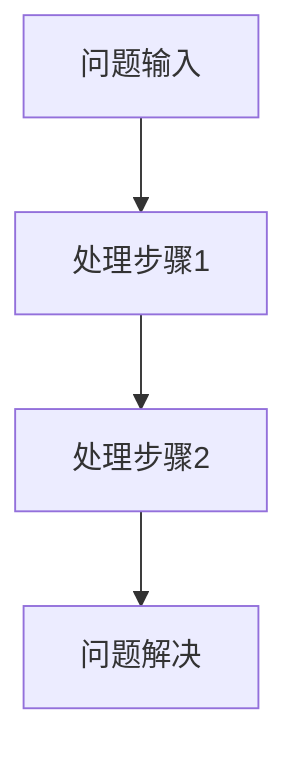
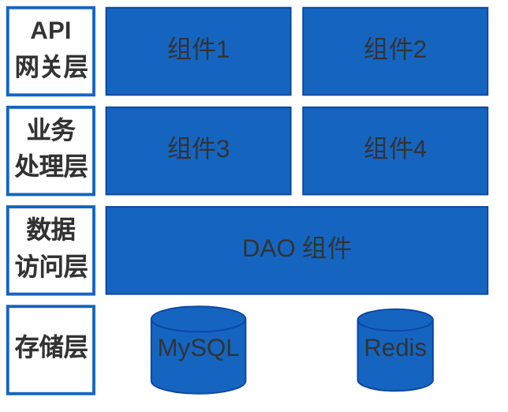
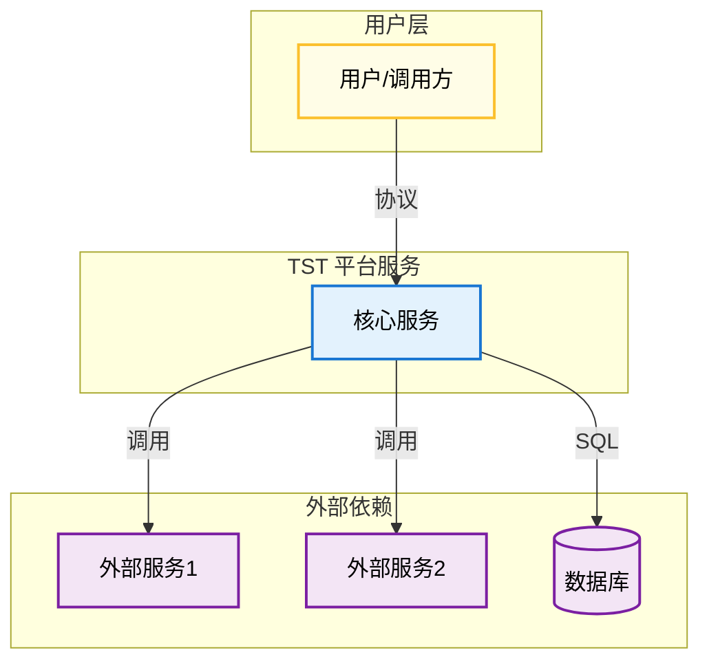
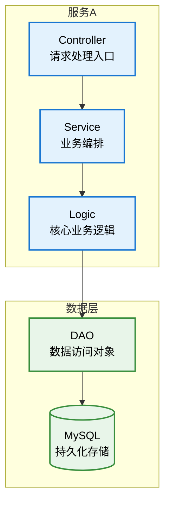
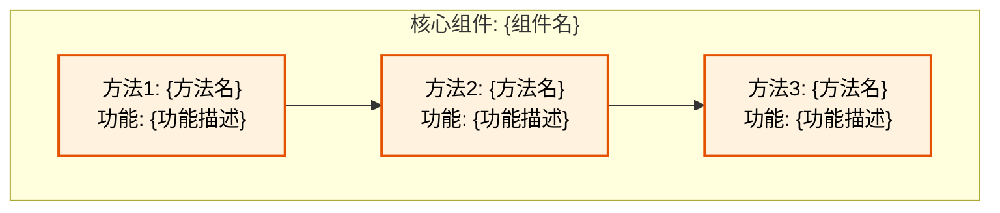
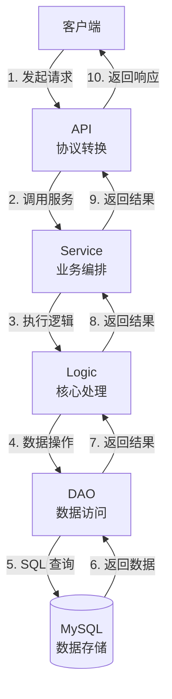
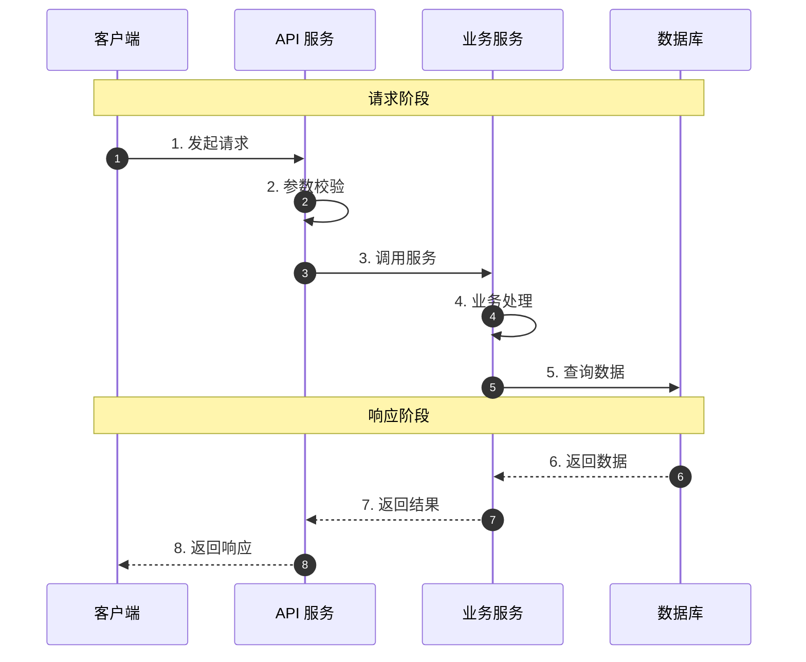

# {功能名称}架构文档

## 目录

- [项目标识](#项目标识)
- [1. 方案调研](#1-方案调研)
  - [1.1 业界方案调研](#11-业界方案调研)
  - [1.2 方案对比分析](#12-方案对比分析)
  - [1.3 调研结论](#13-调研结论)
- [2. 关键问题与解决方案](#2-关键问题与解决方案)
  - [2.1 问题1](#21-问题1)
  - [2.2 问题2](#22-问题2)
- [3. 概要设计](#3-概要设计)
  - [3.1 架构层级图](#31-架构层级图)
  - [3.2 层级说明](#32-层级说明)
  - [3.3 核心数据流](#33-核心数据流)
  - [3.4 核心能力矩阵](#34-核心能力矩阵)
- [4. 功能概述](#4-功能概述)
  - [4.1 功能目标](#41-功能目标)
  - [4.2 核心能力](#42-核心能力)
  - [4.3 依赖组件](#43-依赖组件)
  - [4.4 项目结构](#44-项目结构)
- [5. 系统架构图](#5-系统架构图)
  - [5.1 C4 Context 层级图](#51-c4-context-层级图)
  - [5.2 C4 Container 层级图](#52-c4-container-层级图)
  - [5.3 C4 Component 层级图](#53-c4-component-层级图)
  - [5.4 服务数据流图](#54-服务数据流图)
- [6. 数据模型](#6-数据模型)
- [7. API 定义](#7-api-定义)
- [8. 安全设计](#8-安全设计)
- [术语表](#术语表)
- [附录](#附录)
  - [附录 A: 完整时序图](#附录-a-完整时序图)
  - [附录 B: 参考文献](#附录-b-参考文献)

---

## 项目标识

| 字段 | 值 |
|------|-----|
| **项目名称** | {Project Name} |
| **分支名称** | feature/{branch-name} |
| **仓库地址** | git.garena.com/shopee/bg-logistics/tst/tst-go |
| **联系人** | {Team Name} |
| **文档日期** | {YYYY-MM-DD} |
| **版本** | 1.0.0 |
| **状态** | 设计阶段 |

---

## 1. 方案调研

> **【重点章节】** 本节汇总了对{技术领域}的业界调研结果，为技术选型和架构设计提供依据。在进行概要设计之前，必须充分了解业界最佳实践和各方案的优劣。

### 1.1 业界方案调研

本节总结了对 {技术领域} 的业界调研结果，共收集分析了 **{N}** 篇技术资料。

#### 1.1.1 调研范围

| 维度 | 说明 |
|------|------|
| 调研时间 | {YYYY-MM-DD} |
| 资料数量 | ≥15 篇 |
| 来源类型 | 技术博客、官方文档、开源项目、学术论文、技术演讲 |

#### 1.1.2 主流技术方案

| 方案类型 | 代表实现 | 核心思路 | 典型应用 | 参考资料 |
|----------|----------|----------|----------|----------|
| 方案A | 实现1, 实现2 | 思路描述 | 公司X, 公司Y | [[1]](#ref-1) [[2]](#ref-2) |
| 方案B | 实现3, 实现4 | 思路描述 | 公司Z | [[3]](#ref-3) [[4]](#ref-4) |
| 方案C | 实现5 | 思路描述 | 公司W | [[5]](#ref-5) [[6]](#ref-6) |

#### 1.1.3 方案详情

**方案A: {方案名称}**

{详细描述方案A的核心思路、实现方式、适用场景} [[1]](#ref-1) [[2]](#ref-2)

**优点**:
- 优点1
- 优点2

**缺点**:
- 缺点1
- 缺点2

**方案B: {方案名称}**

{详细描述方案B的核心思路、实现方式、适用场景} [[3]](#ref-3) [[4]](#ref-4)

**优点**:
- 优点1
- 优点2

**缺点**:
- 缺点1
- 缺点2

**方案C: {方案名称}**

{详细描述方案C的核心思路、实现方式、适用场景} [[5]](#ref-5) [[6]](#ref-6)

**优点**:
- 优点1
- 优点2

**缺点**:
- 缺点1
- 缺点2

### 1.2 方案对比分析

#### 1.2.1 多维度对比

| 维度 | 方案A | 方案B | 方案C |
|------|-------|-------|-------|
| 实现复杂度 | ⭐⭐⭐ (高) | ⭐⭐ (中) | ⭐ (低) |
| 性能表现 | ⭐⭐ (中) | ⭐⭐⭐ (高) | ⭐⭐ (中) |
| 可维护性 | ⭐⭐⭐ (高) | ⭐⭐ (中) | ⭐⭐⭐ (高) |
| 扩展性 | ⭐⭐ (中) | ⭐⭐⭐ (高) | ⭐⭐ (中) |
| 社区生态 | ⭐⭐⭐ (成熟) | ⭐⭐ (发展中) | ⭐ (较弱) |

#### 1.2.2 业务适配度

| 业务需求 | 方案A | 方案B | 方案C |
|----------|-------|-------|-------|
| 需求1 | ✅ 支持 | ⚠️ 部分支持 | ❌ 不支持 |
| 需求2 | ✅ 支持 | ✅ 支持 | ✅ 支持 |
| 需求3 | ⚠️ 需改造 | ✅ 支持 | ✅ 支持 |

### 1.3 调研结论

**选定方案**: {方案名称}

**选择理由**:
1. 理由1: 详细说明
2. 理由2: 详细说明
3. 理由3: 详细说明

**需要注意的风险**:
| 风险 | 影响 | 缓解措施 |
|------|------|----------|
| 风险1 | 高/中/低 | 缓解措施描述 |
| 风险2 | 高/中/低 | 缓解措施描述 |

---

## 2. 关键问题与解决方案

> **【重点章节】** 本节详细说明设计过程中识别的关键问题及其解决方案。这些问题来源于调研分析和业务需求，是架构设计的核心驱动因素。

### 2.1 问题1: {问题标题}

**问题背景**:
{描述问题产生的背景和原因}

**问题影响**:
- 影响1
- 影响2

**解决思路**:

下图展示了问题1的解决流程，从问题输入开始，经过多个处理步骤，最终达到问题解决的目标状态。



**图示说明**:
- **问题输入**: {描述输入的数据或触发条件}
- **处理步骤1**: {描述第一步处理的具体操作}
- **处理步骤2**: {描述第二步处理的具体操作}
- **问题解决**: {描述最终达到的目标状态}

**实现要点**:
1. 要点1: 详细描述
2. 要点2: 详细描述

**代码示例**:
```go
// 核心实现代码
func SolveProblem(ctx context.Context, input *Input) (*Output, error) {
    // 实现逻辑
    return output, nil
}
```

### 2.2 问题2: {问题标题}

**问题背景**:
{描述问题产生的背景和原因}

**问题影响**:
- 影响1
- 影响2

**解决思路**:
1. 思路1
2. 思路2

**实现要点**:
1. 要点1
2. 要点2

---

## 3. 概要设计

> 基于方案调研结论和关键问题的解决思路，本节给出系统的概要设计。

### 3.1 架构层级图

{功能名称}采用分层架构设计，各层职责清晰，依赖关系单向。整体架构遵循"高内聚、低耦合"的设计原则，从上到下依次为 API 网关层、业务处理层、数据访问层和存储层。



**图示说明**:
- **API 网关层**: 系统的统一入口，负责请求路由、协议转换、鉴权等功能。组件1 处理 {功能描述}，组件2 处理 {功能描述}。
- **业务处理层**: 核心业务逻辑的实现层。组件3 负责 {功能描述}，组件4 负责 {功能描述}。
- **数据访问层**: 封装所有数据库操作，提供统一的数据访问接口，处理事务管理。
- **存储层**: 底层存储引擎，MySQL 用于持久化存储，Redis 用于缓存和高频访问数据。

### 3.2 层级说明

| 层级 | 组件 | 职责 | 技术栈 |
|------|------|------|--------|
| **API 网关层** | 组件1 / 组件2 | 统一入口，请求路由，协议转换 | gRPC, HTTP |
| **业务处理层** | 组件3 / 组件4 | 核心业务逻辑处理 | Go |
| **数据访问层** | DAO 组件 | 数据库 CRUD 操作，事务管理 | GORM, sqlx |
| **存储层** | MySQL / Redis | 数据持久化，缓存 | MySQL 8.0, Redis 7.0 |

### 3.3 核心数据流

下表描述了数据在系统中流转的主要阶段，每个阶段都标明了数据流向和处理说明。

| 阶段 | 数据流 | 说明 |
|------|--------|------|
| **阶段1** | 输入 → 组件A → 组件B | {详细描述阶段1的数据流转过程和处理逻辑} |
| **阶段2** | 组件B → 组件C → 存储 | {详细描述阶段2的数据流转过程和处理逻辑} |
| **阶段3** | 存储 → 组件D → 输出 | {详细描述阶段3的数据流转过程和处理逻辑} |

### 3.4 核心能力矩阵

下表列出了系统的核心能力及其实现方式。

| 能力 | 实现组件 | 依赖服务 | 说明 |
|------|----------|----------|------|
| 能力1 | 组件A | 服务X | {描述该能力的具体实现方式} |
| 能力2 | 组件B | 服务Y | {描述该能力的具体实现方式} |
| 能力3 | 组件C | 服务Z | {描述该能力的具体实现方式} |

---

## 4. 功能概述

### 4.1 功能目标

本功能实现 {功能描述}，主要目标包括：

1. **目标1**: 描述
2. **目标2**: 描述
3. **目标3**: 描述

### 4.2 核心能力

1. **能力1**: 描述
2. **能力2**: 描述
3. **能力3**: 描述

### 4.3 依赖组件

本功能依赖以下已有组件：

| 组件 | 来源 | 用途 | 版本要求 |
|------|------|------|----------|
| 组件A | 模块X | 用途描述 | v1.0+ |
| 组件B | 模块Y | 用途描述 | v2.0+ |
| 组件C | 外部服务 | 用途描述 | - |

### 4.4 项目结构

以下目录结构展示了本功能相关代码的组织方式：

```
tst-go/
├── tst-apis/                           # API 定义层
│   └── protoapi/.../
│       └── xxx.proto                   # Protobuf 定义
│
├── tst-business-lib/                   # 业务公共库
│   └── pkg/
│       ├── business-compose/xxx/       # 业务组合组件
│       ├── model/xxx/                  # 数据模型
│       └── helper/xxx/                 # 辅助工具
│
├── tst-data/                           # 数据访问层
│   └── pkg/
│       ├── dao/mysql-tab/              # 数据库表结构
│       └── data/container/xxx/         # 数据访问实现
│
└── tst-servers/                        # 服务层
    └── internal/servers/
        └── xxx/
            ├── controller/             # 控制器
            ├── service/                # 服务层
            └── logic/                  # 业务逻辑
```

**目录说明**:
- **tst-apis**: 存放 Protobuf 定义文件，定义 gRPC 接口和消息结构
- **tst-business-lib**: 存放业务公共库，包含可复用的业务组件和数据模型
- **tst-data**: 存放数据访问层代码，包含 DAO 实现和数据库表结构定义
- **tst-servers**: 存放服务层代码，按照 Controller-Service-Logic 分层组织

---

## 5. 系统架构图

### 5.1 C4 Context 层级图

本图展示系统的整体上下文，描述 {功能名称} 与外部系统和用户之间的关系。图中展示了三个主要层次：用户层（系统的使用者）、服务层（核心业务处理）、外部依赖层（系统依赖的外部服务和存储）。



**图示说明**:
| 元素 | 类型 | 描述 |
|------|------|------|
| **用户/调用方** | 用户层 | {描述谁会使用这个系统，通过什么方式调用} |
| **核心服务** | 服务层 | {描述核心服务的主要职责和功能} |
| **外部服务1** | 外部依赖 | {描述外部服务1的用途和调用方式} |
| **外部服务2** | 外部依赖 | {描述外部服务2的用途和调用方式} |
| **数据库** | 外部依赖 | {描述使用的数据库类型和用途} |

### 5.2 C4 Container 层级图

本图展示系统内部的容器划分，描述各容器之间的依赖关系和数据流向。采用经典的 Controller-Service-Logic-DAO 分层架构，每层职责单一，便于维护和测试。



**图示说明**:
| 容器 | 职责 | 技术实现 |
|------|------|----------|
| **Controller** | 请求处理入口，负责参数校验、协议转换、响应封装 | gRPC Handler / HTTP Handler |
| **Service** | 业务编排层，负责组合多个 Logic 完成复杂业务流程 | Go struct with DI |
| **Logic** | 核心业务逻辑，单一职责，可独立测试 | Go struct |
| **DAO** | 数据访问对象，封装数据库操作，提供 CRUD 接口 | GORM / sqlx |
| **MySQL** | 持久化存储，存储业务数据 | MySQL 8.0 |

### 5.3 C4 Component 层级图

本图展示核心组件的内部结构，描述组件内部各方法之间的调用关系。以 {核心组件名} 为例，展示其内部的方法调用流程。



**图示说明**:
| 方法 | 功能描述 | 输入 | 输出 |
|------|----------|------|------|
| **方法1** | {详细描述方法1的功能} | {输入参数说明} | {输出结果说明} |
| **方法2** | {详细描述方法2的功能} | {输入参数说明} | {输出结果说明} |
| **方法3** | {详细描述方法3的功能} | {输入参数说明} | {输出结果说明} |

### 5.4 服务数据流图

#### 5.4.1 服务间调用关系

下图展示了一次完整请求在系统中的流转过程，从客户端发起请求开始，经过各层处理，最终返回响应。每个箭头上的数字表示调用顺序。



**图示说明**:

**请求流程** (步骤 1-5):
1. **客户端 → API**: 客户端通过 gRPC/HTTP 协议发起请求
2. **API → Service**: API 层完成协议转换和参数校验，调用 Service 层
3. **Service → Logic**: Service 层根据业务需求编排 Logic 调用
4. **Logic → DAO**: Logic 层执行业务逻辑，通过 DAO 访问数据
5. **DAO → MySQL**: DAO 层执行 SQL 查询

**响应流程** (步骤 6-10):
6. **MySQL → DAO**: 数据库返回查询结果
7. **DAO → Logic**: DAO 将结果转换为领域对象返回
8. **Logic → Service**: Logic 返回业务处理结果
9. **Service → API**: Service 返回编排后的结果
10. **API → 客户端**: API 层封装响应返回给客户端

#### 5.4.2 服务调用矩阵

下表详细描述了各服务间的调用关系。

| 调用方 | 被调用方 | 协议 | 接口 | 超时 | 重试 | 说明 |
|--------|----------|------|------|------|------|------|
| 客户端 | API | gRPC/HTTP | {接口名} | 30s | 3次 | {调用说明} |
| Service | Logic | 方法调用 | {方法名} | - | - | {调用说明} |
| Logic | DAO | 方法调用 | {方法名} | - | - | {调用说明} |
| DAO | MySQL | SQL | {表名} | 5s | 0次 | {调用说明} |

---

## 6. 数据模型

### 6.1 数据库表设计

以下是本功能涉及的核心数据表设计：

```sql
CREATE TABLE table_name (
    id          INT UNSIGNED PRIMARY KEY AUTO_INCREMENT COMMENT '主键',
    field1      VARCHAR(256) NOT NULL COMMENT '字段1',
    field2      INT NOT NULL COMMENT '字段2',
    create_time BIGINT NOT NULL COMMENT '创建时间戳',
    update_time BIGINT NOT NULL COMMENT '更新时间戳',
    INDEX idx_field1 (field1),
    UNIQUE KEY uk_field2 (field2)
) ENGINE=InnoDB DEFAULT CHARSET=utf8mb4 COMMENT='表描述';
```

**字段说明**:
| 字段名 | 类型 | 约束 | 说明 |
|--------|------|------|------|
| id | INT UNSIGNED | PRIMARY KEY, AUTO_INCREMENT | 主键，自增 |
| field1 | VARCHAR(256) | NOT NULL | {字段1的业务含义} |
| field2 | INT | NOT NULL | {字段2的业务含义} |
| create_time | BIGINT | NOT NULL | 创建时间，Unix 时间戳（秒） |
| update_time | BIGINT | NOT NULL | 更新时间，Unix 时间戳（秒） |

**索引说明**:
| 索引名 | 类型 | 字段 | 用途 |
|--------|------|------|------|
| PRIMARY | 主键 | id | 主键查询 |
| idx_field1 | 普通索引 | field1 | {索引用途说明} |
| uk_field2 | 唯一索引 | field2 | {索引用途说明} |

### 6.2 Go 模型定义

```go
// Model 模型定义
// 对应数据库表 table_name
type Model struct {
    ID         uint32 `json:"id" gorm:"primaryKey;autoIncrement"`           // 主键
    Field1     string `json:"field1" gorm:"type:varchar(256);not null"`     // 字段1
    Field2     int    `json:"field2" gorm:"not null;uniqueIndex:uk_field2"` // 字段2
    CreateTime int64  `json:"create_time" gorm:"not null"`                  // 创建时间
    UpdateTime int64  `json:"update_time" gorm:"not null"`                  // 更新时间
}

// TableName 返回表名
func (Model) TableName() string {
    return "table_name"
}
```

---

## 7. API 定义

### 7.1 请求定义

```protobuf
// XxxReq 请求消息
// 用于 {描述该请求的用途}
message XxxReq {
    string field1 = 1;  // 字段1: {详细说明}
    int32 field2 = 2;   // 字段2: {详细说明}
}
```

**请求参数说明**:
| 参数 | 类型 | 必填 | 说明 | 示例 |
|------|------|------|------|------|
| field1 | string | 是 | {详细说明} | "example" |
| field2 | int32 | 是 | {详细说明} | 100 |

### 7.2 响应定义

```protobuf
// XxxRsp 响应消息
message XxxRsp {
    int32 retcode = 1;   // 返回码: 0-成功, 非0-失败
    string message = 2;  // 返回消息
    string trace_id = 3; // 追踪ID，用于问题排查
    Data data = 4;       // 业务数据
}
```

**响应码说明**:
| 返回码 | 含义 | 处理建议 |
|--------|------|----------|
| 0 | 成功 | 正常处理返回数据 |
| 1001 | 参数错误 | 检查请求参数 |
| 2001 | 业务异常 | 根据 message 提示处理 |
| 5001 | 系统错误 | 联系开发人员 |

---

## 8. 安全设计

### 8.1 数据安全

1. **敏感数据加密**: {描述敏感数据的加密方式}
2. **数据脱敏**: {描述日志和展示时的数据脱敏策略}

### 8.2 接口安全

1. **身份认证**: {描述认证方式，如 JWT, OAuth 等}
2. **权限控制**: {描述权限控制策略}

### 8.3 敏感信息处理

1. **密钥管理**: {描述密钥的存储和轮换策略}
2. **审计日志**: {描述操作审计日志的记录方式}

---

## 术语表

| 术语 | 全称 | 说明 |
|------|------|------|
| **术语1** | {全称} | {详细说明} |
| **术语2** | {全称} | {详细说明} |
| **术语3** | {全称} | {详细说明} |

---

## 附录

### 附录 A: 完整时序图

下图展示了 {功能名称} 的完整请求处理时序，包括所有参与方的交互过程。该时序图描述了从客户端发起请求到接收响应的完整流程。



**时序说明**:
| 步骤 | 参与方 | 操作 | 说明 |
|------|--------|------|------|
| 1 | 客户端 → API | 发起请求 | {描述请求内容} |
| 2 | API | 参数校验 | {描述校验逻辑} |
| 3 | API → Service | 调用服务 | {描述调用方式} |
| 4 | Service | 业务处理 | {描述业务逻辑} |
| 5 | Service → DB | 查询数据 | {描述查询内容} |
| 6 | DB → Service | 返回数据 | {描述返回内容} |
| 7 | Service → API | 返回结果 | {描述结果内容} |
| 8 | API → 客户端 | 返回响应 | {描述响应内容} |

### 附录 B: 参考文献

以下是本设计文档参考的调研资料列表，采用学术论文引用格式：

#### 技术博客与文章

<a id="ref-1"></a>
**[1]** {作者}. "{文章标题}". {平台/网站名称}, {发布日期}. [在线] 可访问: {URL}. [访问日期: {YYYY-MM-DD}]

<a id="ref-2"></a>
**[2]** {作者}. "{文章标题}". {平台/网站名称}, {发布日期}. [在线] 可访问: {URL}. [访问日期: {YYYY-MM-DD}]

<a id="ref-3"></a>
**[3]** {作者}. "{文章标题}". {平台/网站名称}, {发布日期}. [在线] 可访问: {URL}. [访问日期: {YYYY-MM-DD}]

#### 官方文档

<a id="ref-4"></a>
**[4]** {组织/公司}. "{文档标题}". {文档版本}, {发布日期}. [在线] 可访问: {URL}. [访问日期: {YYYY-MM-DD}]

<a id="ref-5"></a>
**[5]** {组织/公司}. "{文档标题}". {文档版本}, {发布日期}. [在线] 可访问: {URL}. [访问日期: {YYYY-MM-DD}]

#### 开源项目

<a id="ref-6"></a>
**[6]** {作者/组织}. "{项目名称}". GitHub, {最后更新日期}. [在线] 可访问: {URL}. Stars: {数量}, License: {许可证}

<a id="ref-7"></a>
**[7]** {作者/组织}. "{项目名称}". GitHub, {最后更新日期}. [在线] 可访问: {URL}. Stars: {数量}, License: {许可证}

#### 学术论文

<a id="ref-8"></a>
**[8]** {作者1}, {作者2}, et al. "{论文标题}". In *{会议/期刊名称}*, {年份}, pp. {页码范围}. DOI: {DOI号}. [在线] 可访问: {URL}

<a id="ref-9"></a>
**[9]** {作者1}, {作者2}. "{论文标题}". *{期刊名称}*, vol. {卷号}, no. {期号}, pp. {页码范围}, {年份}. DOI: {DOI号}

#### 技术演讲与会议

<a id="ref-10"></a>
**[10]** {演讲者}. "{演讲标题}". {会议名称}, {地点}, {日期}. [视频] 可访问: {URL}

<a id="ref-11"></a>
**[11]** {演讲者}. "{演讲标题}". {会议名称}, {地点}, {日期}. [视频] 可访问: {URL}

#### 云厂商最佳实践

<a id="ref-12"></a>
**[12]** {云厂商}. "{文档标题}". {产品文档}, {发布日期}. [在线] 可访问: {URL}. [访问日期: {YYYY-MM-DD}]

<a id="ref-13"></a>
**[13]** {云厂商}. "{文档标题}". {产品文档}, {发布日期}. [在线] 可访问: {URL}. [访问日期: {YYYY-MM-DD}]

#### 其他资料

<a id="ref-14"></a>
**[14]** {作者/来源}. "{标题}". {类型}, {日期}. [在线] 可访问: {URL}

<a id="ref-15"></a>
**[15]** {作者/来源}. "{标题}". {类型}, {日期}. [在线] 可访问: {URL}

---

#### 参考文献汇总表

| 编号 | 类型 | 标题 | 来源 | 链接 |
|------|------|------|------|------|
| [1] | 博客 | {文章标题} | {作者/平台} | [链接]({URL}) |
| [2] | 博客 | {文章标题} | {作者/平台} | [链接]({URL}) |
| [3] | 博客 | {文章标题} | {作者/平台} | [链接]({URL}) |
| [4] | 官方文档 | {文档标题} | {组织} | [链接]({URL}) |
| [5] | 官方文档 | {文档标题} | {组织} | [链接]({URL}) |
| [6] | 开源项目 | {项目名称} | GitHub | [链接]({URL}) |
| [7] | 开源项目 | {项目名称} | GitHub | [链接]({URL}) |
| [8] | 论文 | {论文标题} | {会议/期刊} | [链接]({URL}) |
| [9] | 论文 | {论文标题} | {会议/期刊} | [链接]({URL}) |
| [10] | 演讲 | {演讲标题} | {会议名称} | [链接]({URL}) |
| [11] | 演讲 | {演讲标题} | {会议名称} | [链接]({URL}) |
| [12] | 云厂商 | {文档标题} | {云厂商} | [链接]({URL}) |
| [13] | 云厂商 | {文档标题} | {云厂商} | [链接]({URL}) |
| [14] | 其他 | {标题} | {来源} | [链接]({URL}) |
| [15] | 其他 | {标题} | {来源} | [链接]({URL}) |
